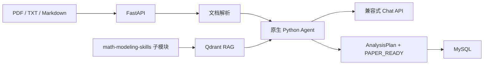

# Math Modeling Agent

> 基于 FastAPI、RAG 和原生 Python 状态机的数学建模赛题分析后端。

[](https://github.com/Lupynow/math-modeling-agent/actions/workflows/ci.yml)
[](LICENSE)

本项目是独立的 AI 应用开发作品集。数学建模领域知识来自只读子模块 [Lupynow/math-modeling-skills](https://github.com/Lupynow/math-modeling-skills)，原 Skill 仓库保持独立维护；本仓库只负责文档解析、RAG、Agent 编排、API、数据库、评测和部署。

## 核心能力

- 上传 PDF、TXT 或 Markdown 赛题。
- 从数学建模 Skill 知识库检索模型、方法和验证策略。
- 将赛题归入预测、分类、评价、优化等 12 类问题。
- 比较多个候选模型，输出适用条件、优点、风险和选择依据。
- 生成版本化 `AnalysisPlan` 和 `PAPER_READY` 论文交接包。
- 使用 MySQL 保存文档、分析运行和指标，Qdrant 保存知识向量。
- 支持 OpenAI-compatible Chat 与 Embedding 接口，二者可使用不同供应商。
- Fake Model 模式无需密钥，可稳定运行测试和离线评测。

## 架构



Agent 状态流：

```text
解析赛题 → 问题分类 → 知识检索 → 候选模型
        → 模型选择 → 验证计划 → Schema 校验 → 保存
```

详细设计见 [架构说明](docs/architecture.md)。

## 获取代码

仓库使用 Git 子模块，需要递归克隆：

```bash
git clone --recurse-submodules https://github.com/Lupynow/math-modeling-agent.git
cd math-modeling-agent
```

已有普通克隆时执行：

```bash
git submodule update --init --recursive
```

## Docker 一键启动

```bash
docker compose up --build
```

默认 `APP_MODE=fake`，不需要 API Key。启动后访问：

- Swagger：<http://localhost:8000/docs>
- 健康检查：<http://localhost:8000/health>
- 就绪检查：<http://localhost:8000/ready>
- 指标：<http://localhost:8000/metrics>

## API 示例

上传赛题：

```bash
curl -X POST http://localhost:8000/api/v1/documents \
  -F "file=@problem.md"
```

使用返回的 `document_id` 创建分析：

```bash
curl -X POST http://localhost:8000/api/v1/analysis-runs \
  -H "Content-Type: application/json" \
  -d '{
    "document_id": "替换为上传结果中的 UUID",
    "contest": "CUMCM",
    "constraints": ["结果必须可解释"]
  }'
```

## 接入真实模型

复制 `.env.example` 为 `.env`，然后配置：

```dotenv
APP_MODE=production
CHAT_API_BASE=https://provider.example.com/v1
CHAT_API_KEY=...
CHAT_MODEL=...
EMBEDDING_API_BASE=https://provider.example.com/v1
EMBEDDING_API_KEY=...
EMBEDDING_MODEL=...
```

API Key 只放在本地 `.env` 或部署平台 Secrets 中。

## 本地开发

推荐 Python 3.11 或 3.12：

```bash
python -m venv .venv
.venv/Scripts/python -m pip install -e ".[dev]"
```

运行：

```bash
.venv/Scripts/uvicorn modeling_agent.main:app --reload
```

验收：

```bash
.venv/Scripts/python scripts/validate_knowledge.py
.venv/Scripts/ruff check src tests evals scripts
.venv/Scripts/mypy src/modeling_agent
.venv/Scripts/pytest tests -m "not integration"
.venv/Scripts/python evals/run_offline_eval.py
```

## 离线评测

`evals/synthetic-problems.jsonl` 含 24 条合成赛题，覆盖 12 类问题。

| 指标 | Fake 基线 | 验收线 |
|---|---:|---:|
| 问题分类准确率 | 100% | ≥ 80% |
| Schema 有效率 | 100% | 100% |
| 引用路径有效率 | 100% | 100% |

这些指标只用于回归测试，不代表真实竞赛成绩或通用模型质量。

## 项目结构

```text
.
├── src/modeling_agent/          # FastAPI、Agent、RAG、模型与数据库
├── tests/                       # 单元、API、供应商和集成测试
├── evals/                       # 24 条合成赛题与评测脚本
├── knowledge/
│   └── math-modeling-skills/    # 只读 Git 子模块
├── schemas/                     # PAPER_READY JSON Schema
├── docs/                        # 架构、学习、证据口径和部署说明
├── scripts/                     # 知识源与敏感信息校验
├── Dockerfile
└── compose.yaml
```

## 安全边界

- 不执行上传文件或模型生成的任意代码。
- 文件采用白名单、大小限制和文件名清洗。
- RAG 引用只能来自已索引知识片段。
- 不把缺失数据、未运行实验或检索失败伪装成真实结果。
- 第一版不含登录、前端、任务队列和外部联网搜索。

建议按 [边学边做路线](docs/learning-path.md) 理解项目，部署前阅读 [部署指南](docs/deployment.md)。

## License

MIT
